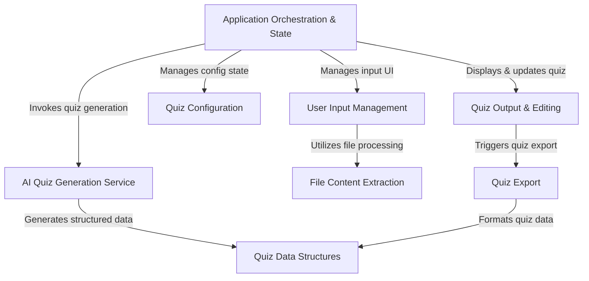

# Run and deploy your AI Studio app

This contains everything you need to run your app locally.

View your app in AI Studio: https://ai.studio/apps/drive/1dRUoJrQIG7vEybcOGIEUSz09jPIUjz04

# SkillCred_Quiz_Creator

SkillCred Quiz Creator is a user-friendly application designed to *simplify quiz creation*. Users can provide source material by **pasting text directly or uploading various document files** (like PDFs, Word docs, or images). They then specify their desired **quiz configuration**, including the number of multiple-choice and true/false questions, and an optional focus topic. The app leverages **AI to generate tailored questions**, which users can *review, edit, add, or delete*. Finally, the perfected quiz can be **exported to common formats like PDF or Word** for easy sharing and use.

## Visual Overview

## Chapters

1. User Input Management
2. Quiz Configuration
3. Application Orchestration & State  
4. File Content Extraction
5. AI Quiz Generation Service
6. Quiz Data Structures
7. Quiz Output & Editing
8. Quiz Export

---

Generated by [AI Codebase Knowledge Builder](https://github.com/The-Pocket/Tutorial-Codebase-Knowledge).
